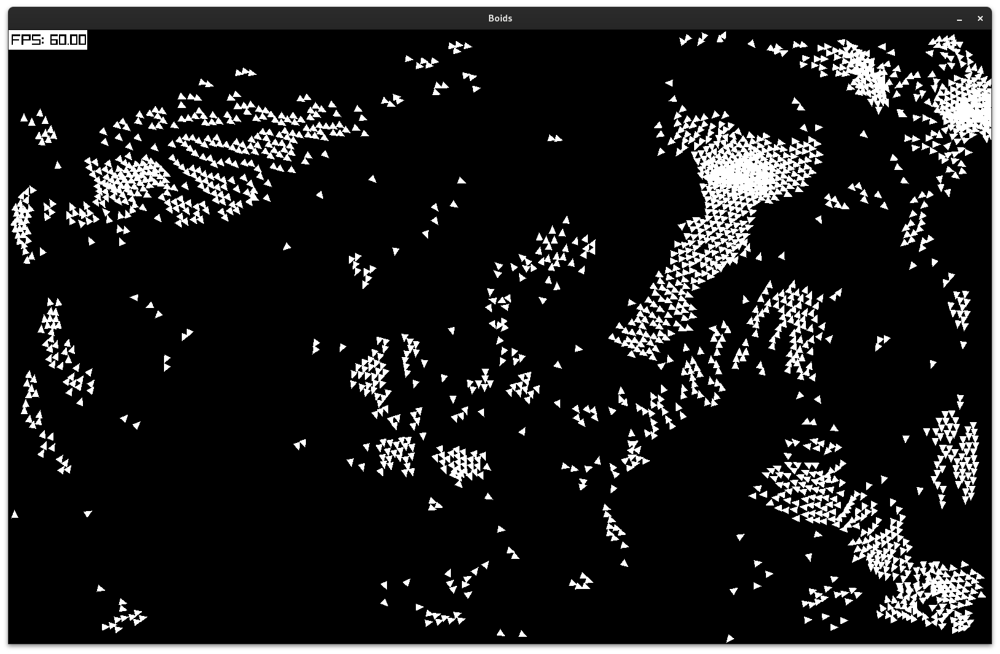

# Go RayLib: Boids

An implementation of Boids using Go and the [RayLib bindings](https://github.com/gen2brain/raylib-go).

## Running the Project

Once you have an executable, the functionality of the program is entirely determined through the `config.yaml` file. The config file give in this repository has some good defaults, but feel free to play around with these! The config parameters are:

- `WindowWidth`: The width of the window, in pixels
- `WindowHeight`: The width of the window, in pixels
- `NumBoids`: The number of boids to spawn
- `BoidVelocity`: The target velocity of each boid
- `BoidVision`: The distance that boids can see, in pixels --- larger visions make for more stable emergent flocks
- `BoidSeparationOptimalProximity`: The proximity measure boids aim for --- a proximity of 1.0 is as close as possible
- `BoidSeparationCoefficient`: How strongly boids weight Separation --- Determines how separated boids should be
- `BoidAlignmentCoefficient`: How strongly boids weight Alignment --- Determines how aligned boids should be, makes boids fly in the same direction
- `BoidCohesionCoefficient`: How strongly boids weight Cohesion --- Determines how cohesive boids should be, makes boids steer towards other boids
- `NumWorkers`: The number of worker goroutines to use --- more go routines means faster frames, but requires more resources
- `RandomSeed`: The random seed used for initialization --- use 0 for a random seed based on the timestamp

## Building the Project

- Ensure you have installed the requirements for RayLib, as per the [raylib-go README](https://github.com/gen2brain/raylib-go).
- Ensure you have Go 1.23 or later installed (although earlier versions may work, just change the `go.mod` file first).
- Clone the repository.
- Run `go build .`, followed by `./Go-RayLib-Boids`. 
    - The first build may take some time, as you will build the RayLib backend too. Future builds will be much faster!